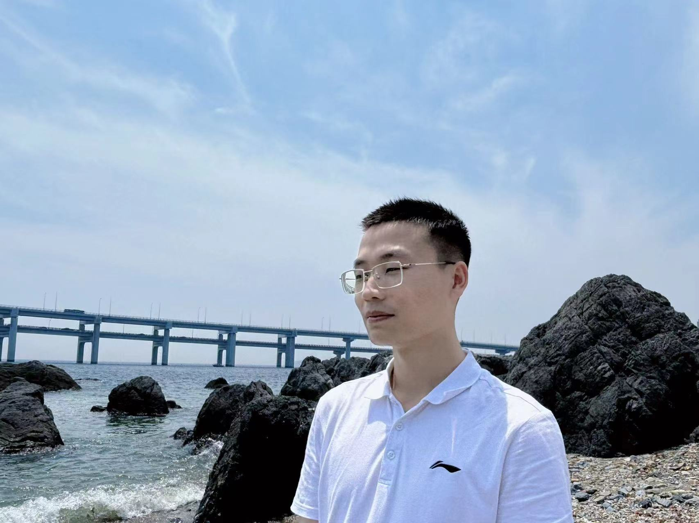

# Zhiqian He 
PhD Assistant  
IEEJ Member  
School of Information Engineering, Dalian Ocean University.  
Email: hezhiqian@dlou.edu.cn & hezhiqian2023@126.com  
Research interests: computer vision, image segmentation, remote sensing object detection, underwater object detection.

[Link to another page](./another-page.html).

# News 
[2024/06] "UAVAI-YOLO：无人机航拍图像的小目标检测模型"is published in 智能科学与技术学报 (CSCD, 中文核心)

[2024/02] "UISS-Net:Underwater Image Semantic Segmentation Network for Improving Boundary Segmentation Accuracy of Underwater Images" is published in Aquaculture International (IF:2.2, JCR Q2)

[2023/09] "Measurement Model：A generic model for size measurement of aquatic products using instance segmentation" is published in Aquaculture International (IF:2.2, JCR Q2)

# Awards
First-class Scholarship for Doctoral Students（2023.12）
National Scholarship（2022, 2019）
First Level Scholarship（2017, 2018, 2019, 2021）
Innovation and Entrepreneurship Scholarship（2021）

# Blogs
GIthub:website

CSDN:website

Bilibili: website

# Internships
Digital Gathering Intelligence Technology, Inc., Algorithm Engineer, 2021.7-2022.9

# Short Bio

He completed his Master's degree at Dalian Ocean University in 2023 under the supervision of Lijie Cao and went on to study for his PhD at Huazhong University of Science and Technology in 2023 under the supervision of Ming Zhu.

