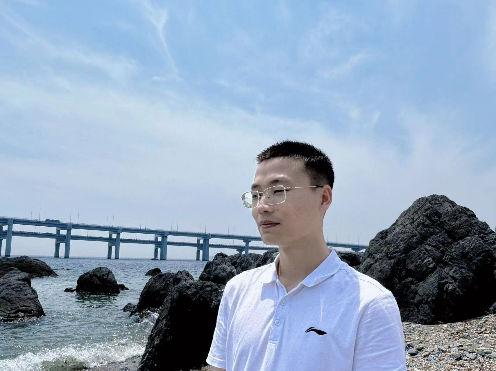

# Zhiqian He (何植仟)
**Ph.D. Student** **Xi'an University of Technology (西安理工大学)** CSIG Student Member | IEEJ Member

**Email:** hezhiqian2023@126.com  
**Research interests:** Computer Vision, Image Segmentation, Remote Sensing Object Detection, Underwater Object Detection.

[Link to another page](./another-page.html).

---

# Short Bio
Zhiqian He is currently a Ph.D. student at **Xi'an University of Technology** (since Sept. 2025), under the supervision of **Prof. Yajun Chen**. Before that, he received his Master's degree from **Dalian Ocean University** (Sept. 2022 - June 2025).

His research focuses on computer vision, specifically in underwater image processing and object detection.

---

# News & Selected Publications

**[2025/04]** "Underwater instance segmentation: a method based on channel spatial cross-cooperative attention mechanism and feature prior fusion" is published in **Frontiers in Marine Science**.

**[2024/10]** "SOD-YOLO: Small Object Detection Network for UAV Aerial Images" is published in **IEEJ Transactions on Electrical and Electronic Engineering**.

**[2024/10]** "UISS-Net: Underwater Image Semantic Segmentation Network for improving boundary segmentation accuracy of underwater images" is published in **Aquaculture International** (IF:2.2, JCR Q2).

**[2024/06]** "UAVAI-YOLO：无人机航拍图像的小目标检测模型" is published in **智能科学与技术学报** (CSCD, 中文核心).

**[2024/04]** "Measurement model: a generic model for size measurement of aquatic products using instance segmentation" is published in **Aquaculture International** (IF:2.2, JCR Q2).

**[2024/01]** "A Measurement Model for Aquatic Animals Based on Instance Segmentation and 3D Point Cloud" is published in **IEEE Access**.

---

# Awards
* **National Scholarship (国家奖学金)** (2025, 2022, 2019)
* **First-class Scholarship (一等奖学金)** (2024, 2023, 2021, 2019, 2018, 2017)
* **Innovation and Entrepreneurship Scholarship** (2021)

---

# Internships
* **Digital Gathering Intelligence Technology, Inc.**, Algorithm Engineer, 2021.7 - 2022.9

---

# Blogs & Links
* **Github:** [Hezhiqian97](https://github.com/Hezhiqian97)
* **CSDN:** [Your CSDN Link]
* **Bilibili:** [Your Bilibili Link]
